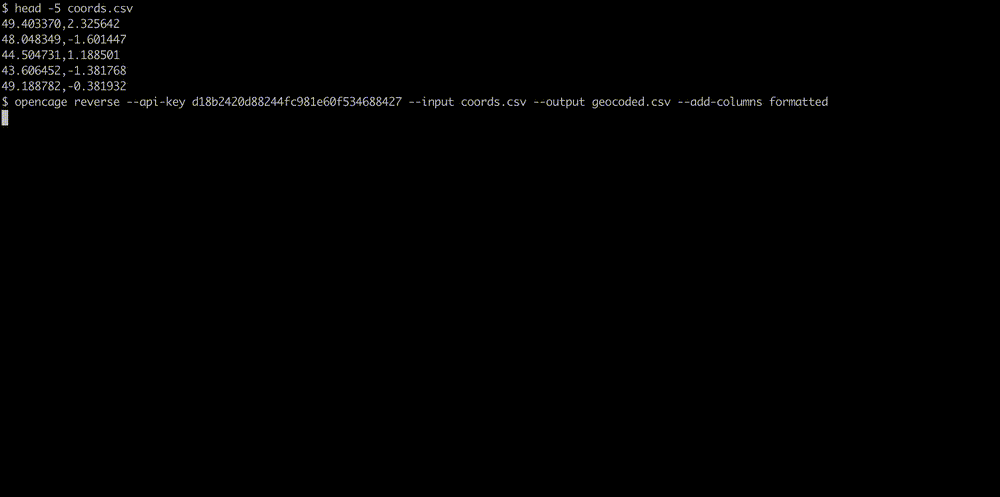

# OpenCage Geocoding Module for Python

A Python module to access the [OpenCage Geocoding API](https://opencagedata.com/).

## Build Status / Code Quality / etc

[](https://badge.fury.io/py/opencage)
[](https://pepy.tech/project/opencage)
[](https://pypi.org/project/opencage/)

[](https://github.com/OpenCageData/python-opencage-geocoder/actions/workflows/build.yml)


## Tutorials

You can find a [comprehensive tutorial for using this module on the OpenCage site](https://opencagedata.com/tutorials/geocode-in-python).

There are two brief video tutorials on YouTube, one [covering forward geocoding](https://www.youtube.com/watch?v=9bXu8-LPr5c), one [covering reverse geocoding](https://www.youtube.com/watch?v=u-kkE4yA-z0).

The module installs an `opencage` CLI tool for geocoding files. Check `opencage --help` or the [CLI tutorial](https://opencagedata.com/tutorials/geocode-commandline).


## Usage

Supports Python 3.8 or newer. Starting opencage version 3.0 depends on asyncio package.

Install the module:

```bash
pip install opencage
```

Load the module:

```python
from opencage.geocoder import OpenCageGeocode
```

Create an instance of the geocoder module, passing a valid OpenCage Data Geocoder API key
as a parameter to the geocoder modules's constructor:

```python
key = 'your-api-key-here'
geocoder = OpenCageGeocode(key)
```

Pass a string containing the query or address to be geocoded to the modules' `geocode` method:

```python
query = '82 Clerkenwell Road, London'
results = geocoder.geocode(query)
```

You can add [additional parameters](https://opencagedata.com/api#forward-opt):

```python
results = geocoder.geocode('London', no_annotations=1, language='es')
```

For example you can use the proximity parameter to provide the geocoder with a hint:

```python
results = geocoder.geocode('London', proximity='42.828576, -81.406643')
print(results[0]['formatted'])
# u'London, ON N6A 3M8, Canada'
```

### Reverse geocoding

Turn a lat/long into an address with the `reverse_geocode` method:

```python
result = geocoder.reverse_geocode(51.51024, -0.10303)
```

### Sessions

You can reuse your HTTP connection for multiple requests by
using a `with` block. This can help performance when making
a lot of requests:

```python
queries = ['82 Clerkenwell Road, London', ...]
with OpenCageGeocode(key) as geocoder:
    # Queries reuse the same HTTP connection
    results = [geocoder.geocode(query) for query in queries]
```

### Asyncronous requests

You can run requests in parallel with the `geocode_async` and `reverse_geocode_async`
method which have the same parameters and response as their synronous counterparts.
You will need at least Python 3.8 and the `asyncio` and `aiohttp` packages installed.

```python
async with OpenCageGeocode(key) as geocoder:
    results = await geocoder.geocode_async(address)
```

For a more complete example and links to futher tutorials on asyncronous IO see
`batch.py` in the `examples` directory.

### Non-SSL API use

If you have trouble accesing the OpenCage API with https, e.g. issues with OpenSSL
libraries in your enviroment, then you can set the 'http' protocol instead. Please
understand that the connection to the OpenCage API will no longer be encrypted.

```python
geocoder = OpenCageGeocode('your-api-key', 'http')
```

### Exceptions

If anything goes wrong, then an exception will be raised:

- `InvalidInputError` for non-unicode query strings
- `NotAuthorizedError` if API key is missing, invalid syntax or disabled
- `ForbiddenError` API key is blocked or suspended
- `RateLimitExceededError` if you go past your rate limit
- `UnknownError` if there's some problem with the API (bad results, 500 status code, etc)

## Command-line batch geocoding

Use `opencage forward` or `opencage reverse`

```
opencage forward --help

options:
  -h, --help            show this help message and exit
  --api-key API_KEY     Your OpenCage API key
  --input FILENAME      Input file name
  --output FILENAME     Output file name
  --headers             If the first row should be treated as a header row
  --input-columns       Comma-separated list of integers (default '1')
  --add-columns         Comma-separated list of output columns (default 'lat,lng,_type,_category,country_code,country,state,county,_normalized_city,postcode,road,house_number,confidence,formatted')
  --workers             Number of parallel geocoding requests (default 1)
  --timeout             Timeout in seconds (default 10)
  --retries             Number of retries (default 5)
  --api-domain          API domain (default api.opencagedata.com)
  --optional-api-params
                        Extra parameters for each request (e.g. language=fr,no_dedupe=1)
  --unordered           Allow the output lines to be in different order (can be faster)
  --limit               Stop after this number of lines in the input
  --dry-run             Read the input file but no geocoding
  --no-progress         Display no progress bar
  --quiet               No progress bar and no messages
  --overwrite           Delete the output file first if it exists
  --verbose             Display debug information for each request
```




## Copyright & License

This software is copyright OpenCage GmbH.
Please see `LICENSE.txt`

### Who is OpenCage GmbH?

<a href="https://opencagedata.com"></a>

We run a worldwide [geocoding API](https://opencagedata.com/api) and [geosearch](https://opencagedata.com/geosearch) service based on open data.
Learn more [about us](https://opencagedata.com/about).

We also run [Geomob](https://thegeomob.com), a series of regular meetups for location based service creators, where we do our best to highlight geoinnovation. If you like geo stuff, you will probably enjoy [the Geomob podcast](https://thegeomob.com/podcast/).
