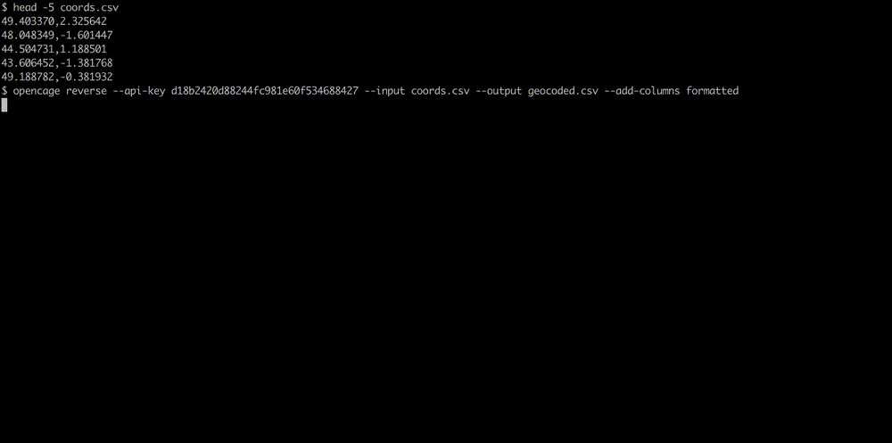

# OpenCage CLI

A command-line tool for the [OpenCage Geocoding API](https://opencagedata.com/), for forward and reverse geocoding of CSV files.

## Build Status / Code Quality / etc

[](https://badge.fury.io/py/opencage-cli)
[](https://pypi.org/project/opencage-cli/)
[](https://github.com/OpenCageData/opencage-cli/actions/workflows/build.yml)

## Tutorial

See the [CLI tutorial on the OpenCage site](https://opencagedata.com/tutorials/geocode-commandline) for a full walk-through.

## Installation

Supports Python 3.9 or newer.

```bash
pip install opencage-cli
```

This installs an `opencage` executable on your `PATH`. The Python geocoding library it uses (the `opencage` package on PyPI) is pulled in as a dependency.

## Usage

Use `opencage forward` or `opencage reverse`:

```
opencage forward --help

options:
  -h, --help            show this help message and exit
  --api-key API_KEY     Your OpenCage API key
  --input FILENAME      Input file name
  --output FILENAME     Output file name
  --headers             If the first row should be treated as a header row
  --input-columns       Comma-separated list of integers (default '1')
  --add-columns         Comma-separated list of output columns (default 'lat,lng,_type,_category,country_code,country,state,county,_normalized_city,postcode,road,house_number,confidence,formatted')
  --workers             Number of parallel geocoding requests (default 1)
  --timeout             Timeout in seconds (default 10)
  --retries             Number of retries (default 10)
  --api-domain          API domain (default api.opencagedata.com)
  --optional-api-params
                        Extra parameters for each request (e.g. language=fr,no_dedupe=1)
  --unordered           Allow the output lines to be in different order (can be faster)
  --limit               Stop after this number of lines in the input
  --dry-run             Read the input file but no geocoding
  --no-progress         Display no progress bar
  --quiet               No progress bar and no messages
  --overwrite           Delete the output file first if it exists
  --verbose             Display debug information for each request
```



See [`examples/addresses.csv`](examples/addresses.csv) for sample input.

## Working with AI / Agent Skill

There is an [Agent Skill for working with the OpenCage Geocoding API](https://github.com/OpenCageData/opencage-skills/).

## Python library

If you want to call the OpenCage API directly from Python rather than via this CLI, install [the `opencage` library](https://pypi.org/project/opencage/) — `pip install opencage`.

## Copyright & License

This software is copyright OpenCage GmbH.
Please see `LICENSE.txt`

### Who is OpenCage GmbH?

<a href="https://opencagedata.com"></a>

We run a worldwide [geocoding API](https://opencagedata.com/api) and [geosearch](https://opencagedata.com/geosearch) service based on open data.
Learn more [about us](https://opencagedata.com/about).

We also run [Geomob](https://thegeomob.com), a series of regular meetups for location based service creators, where we do our best to highlight geoinnovation. If you like geo stuff, you will probably enjoy [the Geomob podcast](https://thegeomob.com/podcast/).
